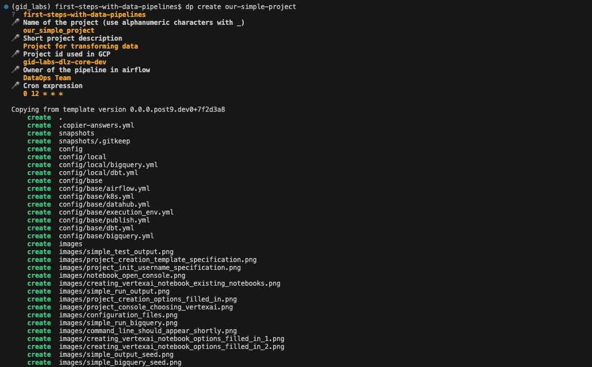
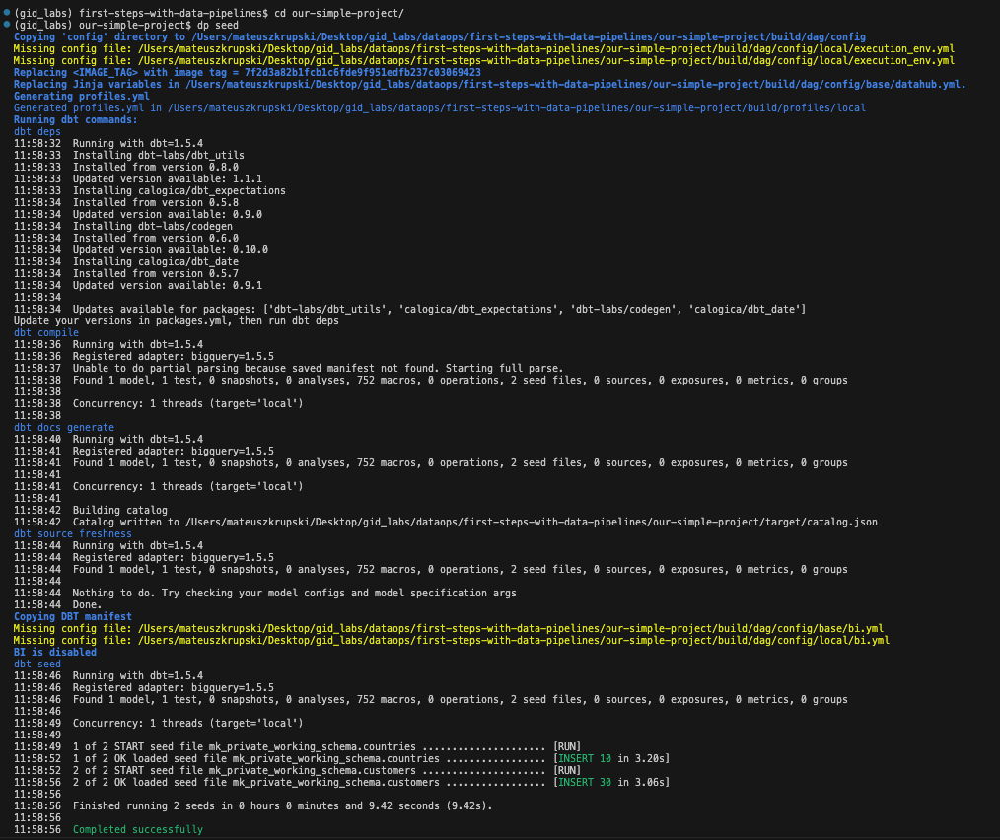
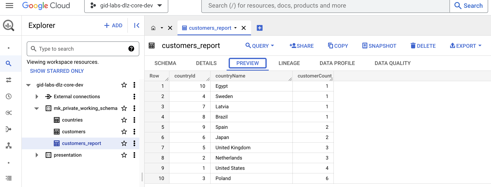

# First steps with Data Pipelines

## Description

This is an example of a simple [Data Pipelines](https://data-pipelines-cli.readthedocs.io/en/latest/index.html) project template with a small amount of data and a simple pipeline and test scenario.
You can learn the basics of how to work with the tool. Below we will describe the steps of how to use [Data Pipelines](https://data-pipelines-cli.readthedocs.io/en/latest/index.html) tool for creating new projects using an existing project template and how to
use the tool for running simple data pipelines on [GCP BigQuery](https://cloud.google.com/bigquery).
This project can be used as a project template for [Data Pipelines](https://data-pipelines-cli.readthedocs.io/en/latest/index.html) tool.
Hopefully thanks to this you will make your first steps with [Data Pipelines](https://data-pipelines-cli.readthedocs.io/en/latest/index.html) tool faster.

This is an example of a simple [Data Pipelines](https://data-pipelines-cli.readthedocs.io/en/latest/index.html) project. If you are looking for a more advanced project, a project with many pipelines, tables and
views, tests and seeds you can find it [here](https://github.com/getindata/tpc-h-data-pipelines-demo.git).

## Demo prerequisites
- You need to have a project on [Google Cloud Platform](https://cloud.google.com/), we will be running DP on [Vertex AI](https://cloud.google.com/vertex-ai)
  Notebook and the results of our pipelines will be stored on [GCP BigQuery](https://cloud.google.com/bigquery)
- You need to have basic understanding of SQL
- You need not to be afraid of a command line

## Data used
For the purpose of this simple project demo we will use the data from 2 CSV files that are placed in the seeds folder.
No other data is being used. Data in both of the CSV files was generated.

## First steps with Data Pipelines

### 1. Environment preparation

Here we will explain how to make it possible to run [Data Pipelines](https://data-pipelines-cli.readthedocs.io/en/latest/index.html) on an instance of
[GCP Vertex AI JupyterLab Notebook](https://cloud.google.com/vertex-ai/docs/workbench/introduction). We start with the main page of our GCP project through [GCP console](https://console.cloud.google.com)


Choose [Vertex AI](https://cloud.google.com/vertex-ai) on the tool menu on the left of [GCP console](https://console.cloud.google.com). On the menu choose Workbench. You should be able to see currently existing Notebooks.


For purpose of this example create a new notebook. We will be using our publically available environment image.
Click new Notebook button. There choose "Customize...". Name your notebook, specify Region, Zone
and for environment scrollbar choose "Custom container" option.
Then for docker container image instead of clicking ```select```, copy and paste this image:
```
gcr.io/getindata-images-public/jupyterlab-dataops:bigquery-1.0.6
```

For machine type, n1-standard-1 (1 vCPU, 3.75 GB RAM) should be good enough for the purpose of this demo.
You can leave other parameters as they are and click ```Create button```.


After some time an instance of Notebook with proper image installed should be available. We should be able to start setting up
the environment for our work.

### 2. Opening the Notebook console

Now, that our [GCP Vertex AI JupyterLab Notebook](https://cloud.google.com/vertex-ai/docs/workbench/introduction) instance has been created, we can open jupyterlab by clicking ```OPEN JUPYTERLAB``` next to the name of
an instance that we just created. The interface for our notebook should open. Several options for working on the instance will be available.


After clicking the ```console``` it should appear in a moment.


### 3. Initialization of Data Pipelines tool

We expect that the whole organization will be using the same [Data Pipelines](https://data-pipelines-cli.readthedocs.io/en/latest/index.html) initialization project that specifies which
templates (DP projects) they are using. Initialization makes it possible to set up some dp variables that can be used
across the whole company. We specify the repository path where we specified the variables that we want dp to be using.
We can have many initialization repos depending on what we want to do with our project.

Here is how you can initialize dp:
```
dp init <path to init repo>
```

If this if your first DP project and you do not have your own templates of projects then
here is an example of a publically available DP init repository that you can use:
```
dp init https://github.com/getindata/data-pipelines-cli-init-example
```

For the purpose of this demo the only variable we will be asked for is going to be
```username``` which is used in many dp commands. We can specify our username as shown below:


You can add more options to dp.yml file with other templates of projects to choose from. Specify their template_names
and the template_paths to git repositories. You can also specify more vars for use in your projects.
The example initialization asks about the name of user, this name will be later used in other operations but
you typically have to run init command only once.

### 4. Creating our own project project

After the initialization is complete we can start using DP. Before we start using DP with command line make sure that we are in ```jovyan``` folder:

```
cd /home/jovyan/
```

Now we will ```create``` a project using a project template. The ```dp create``` command can look like this:

```
dp create <project path> <template path> 
```

```project path``` says in which folder our project, that will be created should be placed. Usually this is just a directory name.
```template path``` is a path of a template to use for creating a new project. This parameter can be skipped. If skipped
we will be able to choose one template of a project from a list specified in the that are specified in ```.dp.yml``` file.

For the purpose of this demo, we will use a template already specified in .dp.yml file. After executing this command:
```dp create our-simple-project``` we should be able to choose a template that we want to use from a list. 


We can switch options by pressing up and down buttons and we can make a decision by pressing enter. For this demo we are going
to use ```first-steps-with-data-pipelines``` template, which is actually the project that you are reading right now.

After pressing enter button, we will be asked some questions about which template to use for a new project, the name of the project,
the name of GCP project that we are working on, the cron that specifies at what times should the DP pipeline run and a
description of the created project. Answer these questions. Be aware that the name of the DP project should be written using alpha-numeric signs plus the underscore sign.



After answering these questions Copier will be used to create contents of our projects using the specified project template.
Good job! The project should have been created successfully.

Now let's enter the project folder.

```cd our-simple-project```

### 5. Config files in config directory

In the ```config``` directory you can find some environment configuration files. These files will be modified were generated from a project template that we used.
When you want to use [Data Pipelines](https://data-pipelines-cli.readthedocs.io/en/latest/index.html) in the future, you will be able to specify the configuration that is suitable for your project.


For the purpose of this demo you do not have to worry about making changes in these files. We can use the default configuration.

### 6. Running pipelines and tests using Data Pipelines tool

This project consists of:
- 2 ```seeds```
- 1 ```model```
- 1 ```test```

To understand more about ```models```, ```tests``` and ```seeds``` please read about them at the
[DBT Documentation](https://docs.getdbt.com/docs/building-a-dbt-project/documentation).

#### 6.1 Executing seeds

When we have our environment ready and the project has been created, the first thing we should do is to execute the ```seeds```.
In this repository there are 2 CSV files specified that contain some data. DBT will use these 2 files as ```seeds```.
After running this command the tables with contents of CSV files will be created in a BigQuery dataset.
The name of the dataset we use is created using our ```username``` value that we provided in the initialization step.
Make sure that you are in the project folder and execute the ```seeds``` with this command:

```
dp seed
```

If we execute the ```seeds``` more times than one then the contents of the tables will be replaced with the same values.
Unless we change the contents of CSV files there will be no change. This is why usually we will only have to run the command once, in the beginning of our work.

Here is an example of what output of this command can look like based on the contents of this repository.



When the process is finished let's check the contents of our BigQuery dataset.
Below is a picture that presents the contents of 2 tables generated in BigQuery based on the 2 ```seed``` CSV files:


#### 6.2 Executing models

The contents of the tables that were created in the ```Executing seeds``` step can be later used in some of the models that we specify.
Now we should be ready to run our models. In the models folder of our template we have specified 1 model that uses the 2```seed``` tables.

Execute the command.

```
dp run
```


This process will look at the contents of the models directory and create coresponding tables or views in our BigQuery Dataset:



#### 6.3 Executing tests

Now after all the tables and views are created we can also check, if the models work as intended by running the tests.
We can have tests that check if the logic behind a query works as intended for a set of data. Let's run the tests.

```
dp test
```


We should be able to see the summary, we can see if everything with our models is fine and there are no errors.

### Reminder:
Remember that if you are interested in seeing a more advanced set of [Data Pipelines](https://data-pipelines-cli.readthedocs.io/en/latest/index.html) you can check
[here](https://github.com/getindata/tpc-h-data-pipelines-demo.git). Seeing a more complicated use case will make it easier for you
to get inspiration on how to use [Data Pipelines](https://data-pipelines-cli.readthedocs.io/en/latest/index.html) in your project.

## Resources:

- More about [data-pipelines-cli](https://data-pipelines-cli.readthedocs.io/en/latest/usage.html#)
- Learn more about dbt [in the docs](https://docs.getdbt.com/docs/introduction)
- Check out [Discourse](https://discourse.getdbt.com/) for commonly asked questions and answers
- Understand [Copier](https://copier.readthedocs.io/en/stable/)
- Try [Airlfow](https://airflow.apache.org/)
